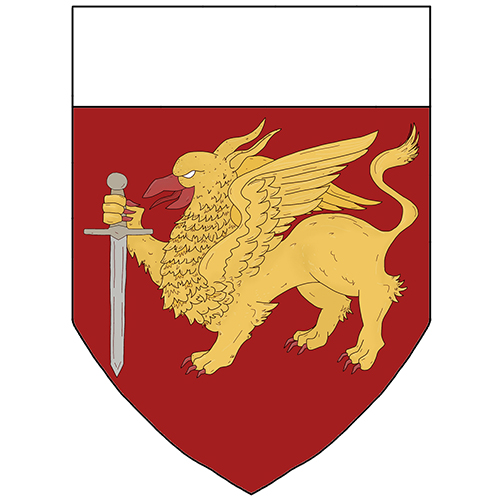

## Über uns

Wir sind ein in Berlin ansässiger Verein zur Pflege und Darstellung Mittelalterlichen Brauchtums. Wir unterteilen uns in Heer und Tross.
Das Heer ist die „Kämpfende Truppe“ und stellt auf den Veranstaltungen z.B. Stadt-, Lager- und Nachtwache und führt die Shows für das Publikum durch.
Der Tross dient der Unterstützung des Heeres, z.B. Wasser reichen am Schlachtfeldrand, Hilfe beim An- und Ablegen der Rüstung und organisiert und bewältigt hauptsächlich den Lageralltag (Nahrungszubereitung, Versorgung etc.). Bei diesen Aufgaben wird der Tross, abhängig von der Lage, vom Heer unterstützt. Zusätzlich wird vom Tross auch Handwerk ausgeübt und vorgeführt.

Die Gefährten des Greifen sind nicht zeithomogen, das bedeutet, dass jeder eine Figur eines Zeitpunktes seiner Wahl innerhalb des Mittelalters für seine Darstellung wählen kann. Das bedeutet, dass seine Ausrüstung und Kleidung dem gewählten Raum entspricht und auf den Erkenntnissen von Forschung und Wissenschaft fußt.
Dabei begrenzen wir uns auf den Europäischen Raum und den Nahen Osten. Wir definieren den Zeitraum des Mittelalters vom 6. Jhdt. bis zum Beginn der Reformation 1517.  

