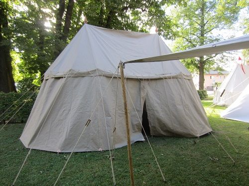
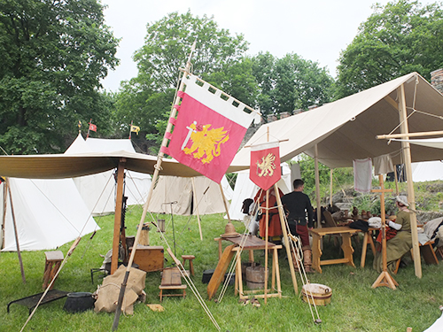
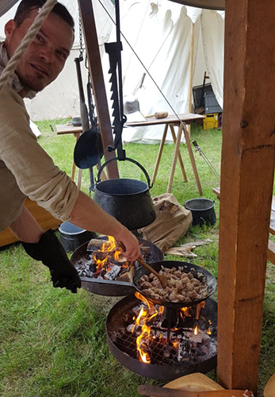
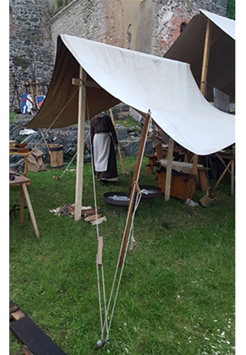

Wir benötigen einen Lagerplatz zwischen 150m² und 250 m².
...und der besteht aus:
* einem Baldachin 6 x 6m aus Leinen
* einem Speichenrad-Zweimastzelt 4 x 7m (Leinen)
* einem Sachsenzelt 5 x 4m (Leinen)
* einem Getelt 6m x 4m (ca. 6m hoch)
* einem Speichenradzelt 4m ø 
* einem Überdachten Kochgalgen 4m x 3m
* mehrere Keilzelte je 2m x 3m
* und evtl. mehreren verschiedenen privaten Zelten

