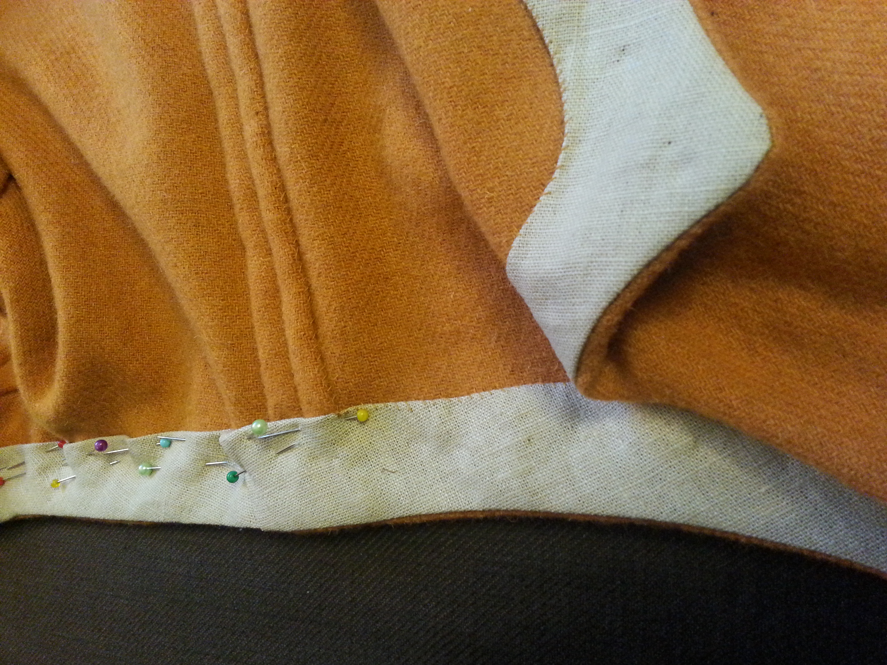

Nähen - jeder kennt es. Wir nähen einen Großteil unserer Kleidung selbst. Dabei nutzen wir verschiedene Sticharten mit der Hand und Garn aus Schafwolle, Seide oder Leinen. Nähte müssen aber auch bei Zeltreparaturen, Lederbearbeitung oder der Herstellung von Gebrauchsgegenständen aus Stoff gemacht werden.
