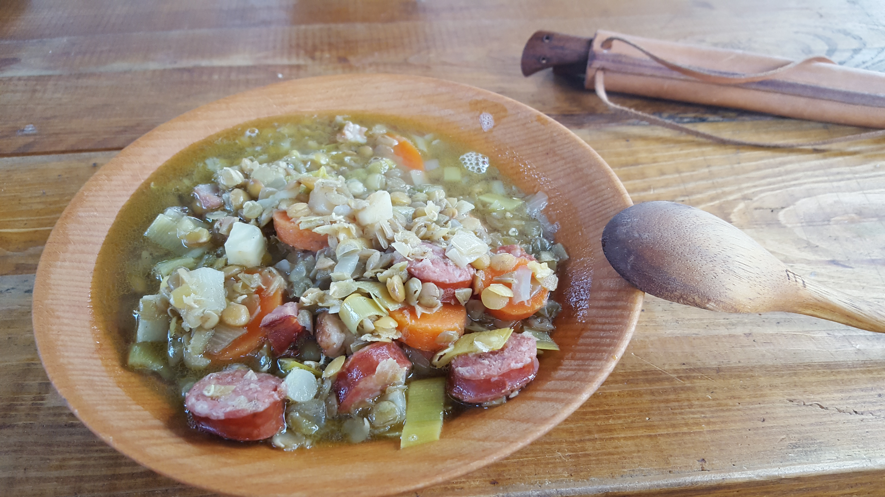

Kochen gehört zu den täglichen Aufgaben im Lager. Wir kochen über offenem Feuer und verzichten möglichst auf alle Zutaten, die es im Mittelalter in Europa noch nicht gegeben hat. Die große Ausnahme dabei sind Gewürze.
