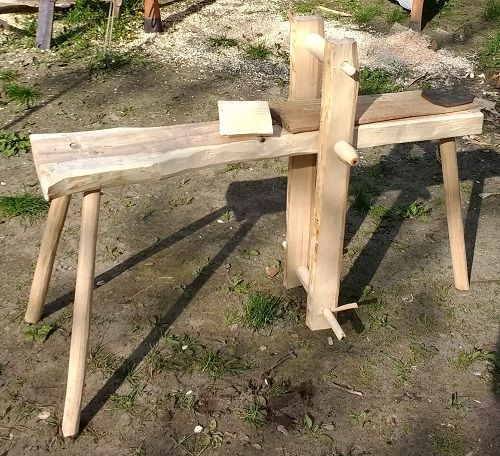

Vom Löffel bis zum Speerschaft - sehr viele unserer Gebrauchsgegenstände sind aus Holz, sei es komplett oder nur zum Teil. Wie man selbiges bearbeitet ist daher sehr nützlich zu wissen. Märkte geben uns immer wieder Gelegenheit, Holzgegenstände herzustellen oder zu reparieren und damit auch dieses Handwerk zu zeigen.
